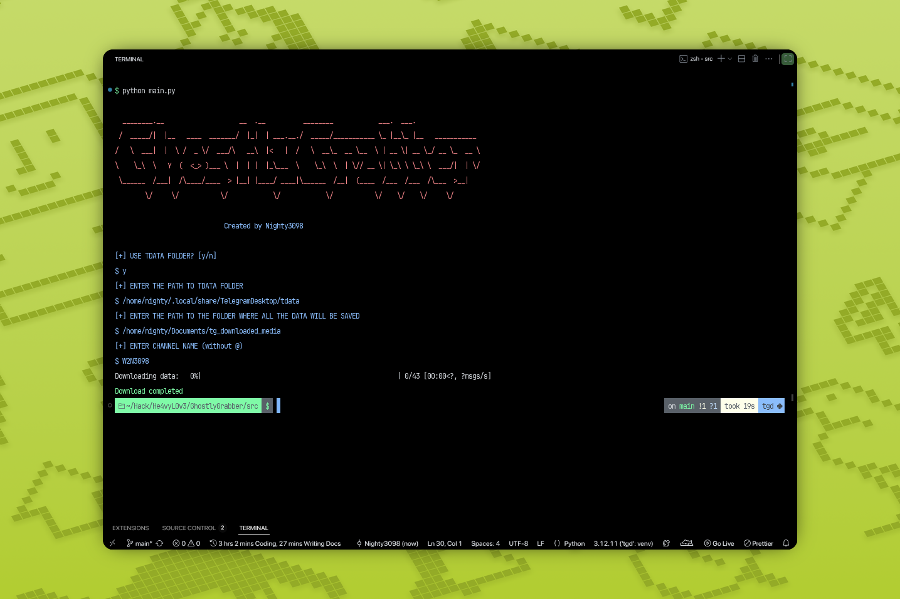

<br />
<div align="left">

### GhostlyGrabber


👻 A utility for automatically downloading media files from Telegram channels and chats with convenient storage and organization of content.

</div>

<br /><br /><br /><br /><br /><br /><br /><br />



<br /><br /><br />

## Features
- Downloads all media (photos, videos, documents, audio) from a Telegram channel or chat
- Saves all posts, discussions, and user info to a local SQLite database
- Organizes media by channel and post
- Supports both public and private channels (if you have access)
- Stores session and all data in a user-specified folder

## Requirements
- Python 3.8+
- All dependencies from `req.txt`
- Telegram API credentials in a `.env` file or environment variables

## .env example
```
API_ID=your_telegram_api_id
API_HASH=your_telegram_api_hash
```

## Installation

```bash
# Clone the repository
$ git clone https://github.com/He4vyL0v3/GhostlyGrabber
$ cd GhostlyGrabber

# Create and activate a virtual environment (recommended)
$ python3 -m venv venv
$ source venv/bin/activate

# Install dependencies
$ pip install -r req.txt
```

## Usage

1. Create a `.env` file in the project root with your Telegram API credentials (see example above).
2. Run the script:

```bash
cd src
python3 main.py
```

### On first run, you will be prompted for:
- **PATH** – The folder where all data (database, media, session) will be saved
- **CHANNEL NAME** – The channel username (without @) or chat name

All data, including the session file (`anon_session.session`), database (`GhostlyGrabber.db`), and downloaded media, will be stored in the folder you specify.

## Project Structure
- `src/main.py` – Main script, entry point
- `src/db.py` – Database logic (SQLAlchemy)
- `src/models.py` – Database models
- `src/dialog.py` – User interaction (logo, input)
- `src/utils.py` – Utility functions
- `req.txt` – List of required Python packages
- `data/image.png` – Project logo

## How it works
1. You enter the target folder and channel/chat name.
2. The script connects to Telegram and downloads all messages and media.
3. All posts, users, and discussions are saved in a local SQLite database.
4. Media files are saved in a structured folder by channel and post.
5. The session file is stored in your chosen folder, so you don't need to log in every time.

## FAQ
- **Can I use this for private channels?**
  - Yes, if your Telegram account has access to the channel.
- **Where is my data stored?**
  - In the folder you specify at first launch (database, media, session file).
- **How do I update the channel?**
  - Just run the script again with the same folder and channel name; it will only download new posts.

## License
Attribution-NonCommercial-NoDerivatives 4.0 International
